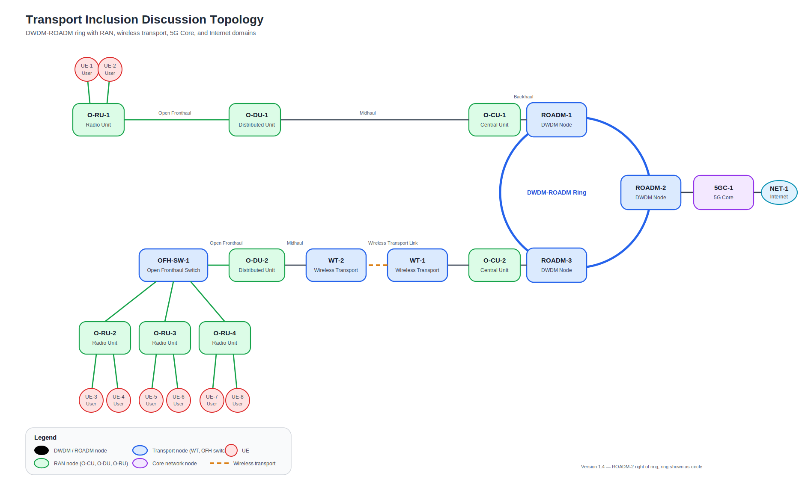
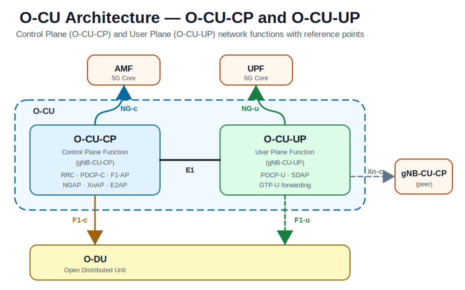

# Multi-Domain Topology - Network Topology Abstraction for SMO

A **unified network topology service** for the O-RAN Service Management and
Orchestration (SMO) framework.  It ingests heterogeneous, device-centric YANG
models from every domain of a reference network (RAN, Open Fronthaul, Wireless
Transport, DWDM/ROADM, 5G Core) and abstracts them into a single, multi-layer
model based on [RFC 8345](https://www.rfc-editor.org/rfc/rfc8345)
(`ietf-network` / `ietf-network-topology`) and its augmentations.

The resulting topology is exposed northbound via RESTCONF/NETCONF so that rApps
and other SMO consumers can query and subscribe to topology changes across all
domains from a single API.

## Reference topology

The following figure shows a reference topology to guide discussion and implementations:




The 5G Core internal managed functions are shown in the next figure:


The O-CU internal architecture (O-CU-CP and O-CU-UP) with reference points is shown below:


## Prerequisites

`yang-repos/` is **not in git** (size + license restrictions). Populate it before doing any YANG work:

```bash
./setup-yang-repos.sh        # auto-clones YangModels/yang, OpenROADM_MSA_Public, 3GPP MnS
# Then manually download O-RAN Alliance ZIPs from https://specifications.o-ran.org
# and extract into the corresponding yang-repos/ subfolders (see README.md for the list)
```

Tools required: `pyang` (≥ 2.7, installed at `~/.local/bin/pyang`) and `yanglint` (≥ 2.1, at `/usr/bin/yanglint`).

## Repository layout

```
multi-domain-topo/
├── topology/                          # Epic specification and use-case diagrams
│   ├── usecase.svg                    # Full reference topology
│   ├── 5gc.svg                        # 5G Core managed functions
│   └── o-cu.svg                       # O-CU: O-CU-CP and O-CU-UP architecture
├── yang-per-network-function/         # YANG model sets organised by NF type
│   ├── O-RU/
│   ├── O-DU/
│   ├── O-CU-CP/                       # O-CU Control Plane (gNB-CU-CP)
│   ├── O-CU-UP/                       # O-CU User Plane (gNB-CU-UP)
│   ├── OpenFronthaul-Switch/
│   ├── WirelessTransport/
│   ├── ROADM/
│   └── 5GCore/
├── data-models-per-network-function-instance/   # Per-instance data
│   ├── O-CU-1/                        # O-CU unit 1 (contains two sub-NFs)
│   │   ├── O-CU-CP-1/                 #   Control Plane NF instance
│   │   └── O-CU-UP-1/                 #   User Plane NF instance
│   ├── O-CU-2/                        # O-CU unit 2
│   │   ├── O-CU-CP-2/
│   │   └── O-CU-UP-2/
│   ├── 5GC-1/<NF>-1/                  # 5GC NF instances (same nested pattern)
│   └── O-DU-1 … O-RU-4 … ROADM-C1 …  # Flat single-NF instances
├── scripts/
│   └── generate-ietf-yang-library.py  # Generates ietf-yang-library.json per instance
├── yang-repos/                        # External YANG model repos — NOT in git (see below)
├── setup-yang-repos.sh                # Script to populate yang-repos/
└── README.md
```

## YANG model repositories

The `yang-repos/` folder contains external YANG model collections.  It is
**excluded from this git repository** for two reasons:

1. **Size** — the collections total ~4.6 GB (well above GitHub's limits).
2. **Licenses** — each collection has its own license that restricts
   redistribution (3GPP, O-RAN Alliance, OpenROADM MSA).

Run the setup script to populate the folder:

```bash
./setup-yang-repos.sh
```

The script will:

| Folder | Source | Method |
|---|---|---|
| `yang-repos/yang/` | [YangModels/yang](https://github.com/YangModels/yang) | `git clone` (automatic) |
| `yang-repos/OpenROADM_MSA_Public/` | [OpenROADM/OpenROADM_MSA_Public](https://github.com/OpenROADM/OpenROADM_MSA_Public) | `git clone` (automatic) |
| `yang-repos/MnS/` | [3GPP SA5 forge](https://forge.3gpp.org/rep/sa5/MnS) | `git clone` (automatic) |
| `yang-repos/O-RAN.WG4.TS.MP-YANGs-R005-v20.00/` | O-RAN Alliance | manual download (see below) |
| `yang-repos/O-RAN.WG4.CTI-TMP-YANG-v03.00/` | O-RAN Alliance | manual download (see below) |
| `yang-repos/O-RAN.WG5.O-DU-O1.1-R003-v09.00/` | O-RAN Alliance | manual download (see below) |
| `yang-repos/O-RAN.WG5.O-CU-O1.1-R003-v07.00/` | O-RAN Alliance | manual download (see below) |
| `yang-repos/O-RAN.WG9.XTRP-SYN.1-R004-v06.00_YANG/` | O-RAN Alliance | manual download (see below) |
| `yang-repos/O-RAN.WG10.TS.Information Model and Data Models.1-R005-v13.00/` | O-RAN Alliance | manual download (see below) |
| `yang-repos/O-RAN.WG10.TS.O1NRM.1-R004-v04.00/` | O-RAN Alliance | manual download (see below) |

### Manual download — O-RAN Alliance spec packages

O-RAN Alliance specifications require registration at
<https://specifications.o-ran.org>.

1. Register / log in at <https://specifications.o-ran.org>.
2. Search for each spec listed in the table above.
3. Download the YANG model ZIP attachment from the spec page.
4. Extract the archive into the corresponding target folder under `yang-repos/`.

The script will print a reminder for any packages that are still missing.

## Repository Architecture

### `yang-per-network-function/<NF>/`

Each subfolder is a **self-contained, flat set of `.yang` symlinks** — every transitive dependency needed by pyang/yanglint must be present as a symlink in the same folder. There are no subdirectories; pyang's `--path` points at the folder itself.

Symlinks follow the naming convention `module-name@revision.yang` and point to the real file in `yang-repos/` using relative paths (`../../yang-repos/...`). Each NF folder also contains:
- `YANG-MODELS.md` — table of all modules with roles (🌳 Root / 🔀 Augment / 📦 Types)
- `yang-tree.txt` — generated YANG tree (pyang -f tree output)
- `validation.log` — generated validation output

**Root modules** (those with a top-level `container` or `list` at 2-space indent) are the YANG tree entry points. pyang folds all augmentations in when all modules are passed together.

### NF model sources

| NF | Primary spec | Key root modules |
|----|-------------|-----------------|
| ROADM | OpenROADM MSA | `ietf-network` (OpenROADM augments it) |
| WirelessTransport | IETF RFC 8561 | `ietf-interfaces`, `ietf-microwave-radio-link`, `ietf-network` |
| OpenFronthaul-Switch | IEEE 802.1Q/AB | `ieee802-dot1q-bridge`, `ieee802-dot1ab-lldp`, `ietf-interfaces`, `ietf-routing` |
| O-RU | O-RAN WG4 MP-YANGs R005 v20.00 | 43 o-ran-* and ietf-* roots |
| O-DU | O-RAN WG5 O-DU-O1 R003 v09.00 | `_3gpp-common-managed-element`, `o-ran-aggregation-base`, + 12 more |
| O-CU-CP | O-RAN WG5 O-CU-O1 R003 v07.00 + 3GPP MnS | `_3gpp-common-managed-element`, `_3gpp-common-subnetwork` (50 implemented modules) |
| O-CU-UP | 3GPP MnS + O-RAN WG10 O1NRM | `_3gpp-common-managed-element`, `_3gpp-common-subnetwork` (45 implemented modules) |
| 5GCore | 3GPP MnS TS 28.541 + O-RAN WG10 O1NRM | `_3gpp-common-managed-element`, `_3gpp-common-subnetwork` |

> **O-CU note:** The O-CU is one logical unit (gNB-CU) but comprises two separately managed NFs — O-CU-CP and O-CU-UP — connected via the **E1** interface. In this repository they are modelled as sibling sub-directories under each `O-CU-N/` parent, each with its own `ietf-yang-library.json` reflecting the distinct YANG module set for that plane.

### 3GPP NRM augmentation pattern

All 3GPP-based NFs (O-DU, O-CU-CP, O-CU-UP, 5GCore) use the same anchor: `_3gpp-common-managed-element` defines the `ManagedElement` list. NF-specific objects (e.g. `GNBDUFunction`, `AMFFunction`) are added via `augment "/me3gpp:ManagedElement"` in their respective modules. This means the YANG tree always starts at `ManagedElement`; the NF modules produce no independent tree sections.

The `_3gpp-5gc-nrm-ep` module imports all 17 5GC NF function modules — including it in any NF folder forces all 17 functions as transitive dependencies.

### `data-models-per-network-function-instance/`

Per-NF-instance data directories, each containing `ietf-system.json` (RFC 7317 system information) and `ietf-yang-library.json` (RFC 8525 YANG library). Intended for instance-specific YANG data and config samples used by the topology engine.

Two nesting patterns are used:

| Pattern | Example | When used |
|---------|---------|-----------|
| `<parent>/<sub-NF>-N/` | `O-CU-1/O-CU-CP-1/`, `5GC-1/AMF-1/` | NFs that are logically part of a larger unit (O-CU, 5GC cluster) |
| `<inst>/` | `O-DU-1/`, `ROADM-B1/`, `WT-1/` | Standalone single-NF instances |

**O-CU** is modelled as a parent unit (`O-CU-1`, `O-CU-2`) that contains two separate NF instances:
- `O-CU-CP-N/` — Control Plane (gNB-CU-CP): RRC, PDCP-C, F1-AP, NGAP, XnAP, E2AP
- `O-CU-UP-N/` — User Plane (gNB-CU-UP): PDCP-U, SDAP, GTP-U forwarding

This mirrors the 3GPP separation of O-CU-CP and O-CU-UP as distinct Managed Elements connected via the E1 interface.

### `yang-repos/` layout (not in git)

```
yang-repos/
├── yang/                          # YangModels/yang — IETF, IANA, IEEE standards
│   └── standard/ietf/RFC/        # Most IETF/IANA modules live here
│   └── standard/ieee/published/  # IEEE 802.1Q, 802.1AB, etc.
├── OpenROADM_MSA_Public/          # OpenROADM MSA models
│   └── 17.1.0/                   # Version-specific trees
├── MnS/                           # 3GPP SA5 Management & Orchestration
│   └── yang-models/              # All 3GPP NRM modules (_3gpp-*)
├── O-RAN.WG4.TS.MP-YANGs-R005-v20.00/   # O-RU M-Plane YANG (o-ran-*)
├── O-RAN.WG5.O-DU-O1.1-R003-v09.00/    # O-DU O1 YANG
├── O-RAN.WG5.O-CU-O1.1-R003-v07.00/    # O-CU O1 YANG
└── O-RAN.WG10.TS.O1NRM.1-R004-v04.00/  # O1 NRM (o-ran-o1-*)
```

## Adding YANG Modules to an NF Folder

1. Find the upstream file in `yang-repos/`.
2. Create a symlink in the NF folder: `ln -sf ../../yang-repos/<path>/module.yang module@revision.yang`
3. The symlink name **must** include `@YYYY-MM-DD` matching the `revision` statement in the file.
4. Run `./validate-yang.sh` — if pyang reports "module not found", add the missing transitive deps too.
5. Re-run `./generate-yang-tree.sh` to update `yang-tree.txt`.
6. Update `YANG-MODELS.md` with the new module entry.

## Vendor Exclusion Filter (validate-yang.sh)

Errors from these module name patterns are treated as informational (not build failures):
`/ietf-`, `/iana-`, `/ieee`, `/org-openroadm-`, `/org-3gpp-`, `/o-ran-`, `/o-ran_`, `/_3gpp-`

This means pyang/yanglint structural errors inside upstream specs never fail the build — only errors in locally-authored modules do.


## Standards used

| Standard | Description |
|---|---|
| RFC 8345 | `ietf-network` / `ietf-network-topology` — base topology model |
| RFC 8795 | `ietf-te-topology` — Traffic Engineering extensions |
| RFC 8561 | `ietf-microwave-topology` — Wireless transport layer |
| `ietf-l2-topology` | Ethernet / Layer-2 layer |
| `ietf-l3-unicast-topology` | IP / Layer-3 layer |
| `org-openroadm-network-topology` | DWDM / photonic layer |
| `o-ran-*` | O-RU, O-DU, O-CU topology augmentations |

## Contributing

Contributions are welcome.  Please open an issue or pull request.  When adding
or updating YANG model mappings, reference the relevant RFC or spec version in
the commit message.
