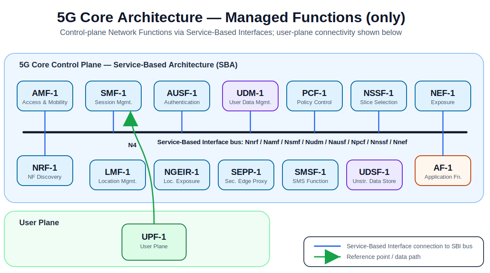

# 5GCore — YANG Models

The **5G Core (5GC)** implements the service-based architecture (SBA) defined by 3GPP TS 23.501.
All 5GC NF managed objects follow the 3GPP SA5 NRM pattern: NF-specific objects (e.g.
`AMFFunction`, `SMFFunction`) augment the common `ManagedElement` list defined in
`_3gpp-common-managed-element`. O-RAN does not define extensions or augmentations for 5GC NFs;
the management model is purely 3GPP SA5 scope.

## Structure

```
5GCore/
├── yang-models/    ← canonical flat folder: 41 YANG symlinks (all 5GC modules)
├── AMF  →  yang-models/
├── SMF  →  yang-models/
├── UPF  →  yang-models/
└── ...  (17 NF directory symlinks total)
```

`yang-models/` contains the complete 5GC NRM module set including `_3gpp-5gc-nrm-ep` (the hub
module that defines all N-interface endpoints) and its dependencies. Each NF-named entry is a
directory symlink to `yang-models/` — all NFs share the same YANG module set because the 3GPP
5GC NRM is a single interconnected model.

For **sysrepo/netopeer2** deployment: point the YANG search path at `yang-models/` and install
only the NF-specific function module (e.g. `_3gpp-5gc-nrm-amffunction`); sysrepo resolves all
transitive dependencies from the search path automatically.

## NF Directory Symlinks

| NF | Symlink | 3GPP Function |
|----|---------|---------------|
| AMF | `AMF → yang-models/` | Access and Mobility Management |
| SMF | `SMF → yang-models/` | Session Management |
| UPF | `UPF → yang-models/` | User Plane Function |
| AUSF | `AUSF → yang-models/` | Authentication Server |
| UDM | `UDM → yang-models/` | Unified Data Management |
| UDSF | `UDSF → yang-models/` | Unstructured Data Storage |
| NRF | `NRF → yang-models/` | NF Repository |
| NSSF | `NSSF → yang-models/` | Network Slice Selection |
| PCF | `PCF → yang-models/` | Policy Control |
| NEF | `NEF → yang-models/` | Network Exposure |
| AF | `AF → yang-models/` | Application Function |
| LMF | `LMF → yang-models/` | Location Management |
| N3IWF | `N3IWF → yang-models/` | Non-3GPP Interworking |
| NGEIR | `NGEIR → yang-models/` | Equipment Identity Register |
| SEPP | `SEPP → yang-models/` | Security Edge Protection Proxy |
| SMSF | `SMSF → yang-models/` | SMS Function |

## YANG Tree Entry Points

| Module | Role |
|--------|------|
| `_3gpp-common-managed-element` | 🌳 **Root** — `ManagedElement` list; all 17 NF objects augment it |
| `_3gpp-common-subnetwork` | 🌳 **Root** — `SubNetwork` list; O1 topology grouping |
| `ietf-yang-schema-mount` | 🌳 **Root** — RFC 8528 schema mount declarations |

## Validation and Tree Generation

```bash
# Validate and generate tree via yang-models/ directly
./validate-yang.sh yang-per-network-function/5GCore/yang-models
./generate-yang-tree.sh yang-per-network-function/5GCore/yang-models

# Or via any NF symlink (resolves to yang-models/ via realpath)
./validate-yang.sh yang-per-network-function/5GCore/AMF
```

## Module Set (41 modules — 3GPP only, no O-RAN WG10)

### 5GC NRM Function Modules (17)

| Module | Revision | Description |
|--------|----------|-------------|
| `_3gpp-5gc-nrm-amffunction` | 2025-11-06 | `AMFFunction` — UE registration, mobility, authentication (N1/N2) |
| `_3gpp-5gc-nrm-smffunction` | 2025-11-06 | `SMFFunction` — PDU session, IP allocation, UPF selection (N4/N11) |
| `_3gpp-5gc-nrm-upffunction` | 2025-11-06 | `UPFFunction` — User-plane forwarding (N3/N6/N9) |
| `_3gpp-5gc-nrm-ausffunction` | 2025-11-06 | `AUSFFunction` — UE authentication (5G-AKA/EAP-AKA') |
| `_3gpp-5gc-nrm-udmfunction` | 2025-11-06 | `UDMFunction` — Subscriber data management |
| `_3gpp-5gc-nrm-udsffunction` | 2025-11-06 | `UDSFFunction` — Unstructured NF state storage |
| `_3gpp-5gc-nrm-nrffunction` | 2025-08-18 | `NRFFunction` — NF registration and discovery |
| `_3gpp-5gc-nrm-nssffunction` | 2025-11-06 | `NSSFFunction` — Network slice selection |
| `_3gpp-5gc-nrm-pcffunction` | 2025-11-06 | `PCFFunction` — QoS and charging policy (N7/N15) |
| `_3gpp-5gc-nrm-neffunction` | 2025-11-06 | `NEFFunction` — Network capability exposure |
| `_3gpp-5gc-nrm-affunction` | 2023-09-18 | `AFFunction` — Trusted application function |
| `_3gpp-5gc-nrm-dnfunction` | 2023-09-18 | `DNFunction` — External data network point |
| `_3gpp-5gc-nrm-lmffunction` | 2025-11-06 | `LMFFunction` — UE location/positioning |
| `_3gpp-5gc-nrm-n3iwffunction` | 2023-09-18 | `N3IWFFunction` — Non-3GPP access interworking |
| `_3gpp-5gc-nrm-ngeirfunction` | 2025-11-06 | `NGEIRFunction` — Device identity register |
| `_3gpp-5gc-nrm-seppfunction` | 2023-09-18 | `SEPPFunction` — Inter-PLMN security proxy (N32) |
| `_3gpp-5gc-nrm-smsffunction` | 2025-11-06 | `SMSFFunction` — SMS over NAS |

### 5GC NRM Supporting Modules (6)

| Module | Revision | Description |
|--------|----------|-------------|
| `_3gpp-5gc-nrm-ep` | 2023-09-18 | Hub module: imports all 17 NF modules; defines all N-interface endpoint objects |
| `_3gpp-5gc-nrm-configurable5qiset` | 2023-09-18 | Configurable 5QI set (operator-defined QoS profiles) |
| `_3gpp-5gc-nrm-ecmconnectioninfo` | 2024-01-29 | ECM connection information groupings |
| `_3gpp-5gc-nrm-nfservice` | 2025-08-18 | NF service instance (name, version, endpoints) |
| `_3gpp-5gc-nrm-nfprofile` | 2025-08-25 | NF profile (type, PLMN, capacity, FQDN) |
| `_3gpp-5gc-nrm-managed-nfprofile` | 2025-11-06 | Managed NF profile with O1 management attributes |

### 3GPP Common Framework (15)

| Module | Revision | Description |
|--------|----------|-------------|
| `_3gpp-common-managed-element` | 2025-03-24 | 🌳 `ManagedElement` list |
| `_3gpp-common-subnetwork` | 2025-03-24 | 🌳 `SubNetwork` list |
| `_3gpp-common-managed-function` | 2025-08-06 | Base NF object grouping |
| `_3gpp-common-top` | 2023-09-18 | List key (`id`) grouping |
| `_3gpp-common-ep-rp` | 2023-09-18 | Endpoint/reference-point base |
| `_3gpp-common-fm` | 2026-01-24 | Fault management groupings |
| `_3gpp-common-trace` | 2025-08-06 | Trace configuration |
| `_3gpp-common-measurements` | 2025-08-06 | PM measurement configuration |
| `_3gpp-common-subscription-control` | 2025-11-06 | O1 event subscription control |
| `_3gpp-common-files` | 2025-07-01 | File management groupings |
| `_3gpp-common-yang-types` | 2025-11-06 | 3GPP common types (Mcc, Mnc, CellIdentity) |
| `_3gpp-common-yang-extensions` | 2025-02-06 | 3GPP YANG extension statements |
| `_3gpp-5g-common-yang-types` | 2025-08-18 | 5G types (SNSSAI, PLMN-ID, NSSAI, DNN) |
| `_3gpp-nr-nrm-gnbcuupfunction` | 2024-05-24 | Transitive dep: AMF imports GNBCUUPFunction |
| `_3gpp-nr-nrm-ecmappingrule` | 2025-05-06 | ECM rule groupings |

### IETF Base (3)

| Module | Revision | Description |
|--------|----------|-------------|
| `ietf-yang-schema-mount` | 2019-01-14 | 🌳 RFC 8528 schema mount |
| `ietf-inet-types` | 2025-12-22 | RFC 6991 IP address / FQDN types |
| `ietf-yang-types` | 2025-12-22 | RFC 6991 base YANG types |

## 5G Core managed Network Function 

The following table lists only the 5G Core network functions which are "managed" according to [3GPP TS 23.501 V18 12.0 (2025-12)](https://www.3gpp.org/ftp/Specs/archive/23_series/23.501/23501-ic0.zip).

A reference 5G Core Topology for 5G Core managed functions is shown in the next figure. 



<a id="nf-table"></a>

| Function (Abbreviation) | Name (short description)                              | Description |
|-------------------------|--------------------------------------------------------|-------------|
| AF                      | Application Function                                   | Application-layer function that interacts with the 5G Core, typically via NEF and/or PCF, to influence traffic routing, QoS, and policy based on service needs (e.g., video, IoT, enterprise apps). [[7]](#ref-7)[[2]](#ref-2) |
| AMF                     | Access and Mobility Management Function                | Control-plane NF handling UE registration, connection and mobility management, reachability, and access authentication orchestration; it terminates N1/N2 and coordinates with SMF, AUSF, UDM, NSSF, and others. [[1]](#ref-1)[[2]](#ref-2) |
| AUSF                    | Authentication Server Function                         | Central authentication NF that performs 5G AKA/EAP-AKA’ procedures, validates credentials from UDM/ARPF, and provides authentication results to AMF during UE registration and access. [[1]](#ref-1)[[2]](#ref-2) |
| LMF                     | Location Management Function                           | Function in the 5G location services architecture responsible for coordinating positioning procedures, obtaining UE location estimates from RAN/UE and providing location information to consumers (e.g., emergency services, apps). [[8]](#ref-8) |
| NEF                     | Network Exposure Function                              | Exposure and mediation NF that securely exposes 3GPP network capabilities and events to external AFs, performs protocol and information translation, and enforces access and throttling policies for northbound APIs. [[3]](#ref-3)[[5]](#ref-5)[[7]](#ref-7) |
| NGEIR                   | Next-Generation Equipment Identity Register            | 5G evolution of the equipment identity register (5G-EIR) that stores and manages IMEI/PEI status (e.g., white/grey/black lists) and provides device identity checks to the 5GC for fraud and theft prevention. [[8]](#ref-8)[[10]](#ref-10) |
| NRF                     | NF Repository Function                                 | Service registry and discovery NF that stores NF profiles and available service instances, allowing NFs to register/deregister and discover each other dynamically in the service-based architecture. [[1]](#ref-1)[[3]](#ref-3)[[2]](#ref-2) |
| NSSF                    | Network Slice Selection Function                       | NF that assists AMF in selecting appropriate network slice instances and allowed NSSAI for a UE, based on subscription data, slice availability, and operator policies. [[4]](#ref-4)[[2]](#ref-2) |
| PCF                     | Policy Control Function                                | Central policy engine that provides unified policy rules, including QoS and some charging aspects, to control-plane NFs like SMF and AMF, replacing and extending the PCRF role from EPC. [[1]](#ref-1)[[3]](#ref-3)[[2]](#ref-2) |
| SEPP                    | Security Edge Protection Proxy                         | Per-PLMN security gateway for inter-PLMN control-plane traffic, e.g., N32, that provides topology hiding, message filtering, integrity and confidentiality protection for roaming scenarios. [[8]](#ref-8) |
| SMF                     | Session Management Function                            | Control-plane NF that manages PDU sessions, including establishment, modification, and release, allocates IP addresses, selects and controls UPF(s), and enforces session-related policy and charging instructions. [[1]](#ref-1)[[3]](#ref-3)[[2]](#ref-2) |
| SMSF                    | SMS Function                                           | NF providing SMS over NAS support in 5GS, handling control and interworking aspects so that SMS can be delivered via 5G Core even without legacy CS domain. [[8]](#ref-8) |
| UDM                     | Unified Data Management                                | Subscriber data management NF that holds subscription, identifiers (SUPI, SUCI), authentication data with ARPF, and access authorization information, supporting other NFs like AMF, SMF, and PCF. [[1]](#ref-1)[[3]](#ref-3)[[2]](#ref-2) |
| UDSF                    | Unstructured Data Storage Function                     | Optional data-layer NF that stores and retrieves unstructured or semi-structured dynamic state, e.g., session context, so that control-plane NFs can become stateless and offload their internal state to a shared storage. [[6]](#ref-6)[[9]](#ref-9)[[11]](#ref-11) |
| UPF                     | User Plane Function                                    | User-plane NF that anchors, routes, and forwards user traffic, enforces QoS and traffic steering, performs buffering and packet inspection, and connects the 5GC to data networks over N3/N6. [[1]](#ref-1)[[2]](#ref-2)[[3]](#ref-3) |

### References

<a id="ref-1"></a>
[1] [5GC function descriptions (NXG Connect)](https://www.nxgconnect.com/post/5g-core-network-architecture-components-their-functional-descriptions) [↩](#nf-table)

<a id="ref-2"></a>
[2] [5G Core architecture overview (ShareTechnote)](https://www.sharetechnote.com/html/5G/5G_NetworkArchitecture.html) [↩](#nf-table)

<a id="ref-3"></a>
[3] [5G Core network functions (Grandmetric)](https://www.grandmetric.com/5g-core-network-functions/) [↩](#nf-table)

<a id="ref-4"></a>
[4] [5G Core Network Functions Explained (study doc)](https://studylib.net/doc/25879689/5g-core-network-functions) [↩](#nf-table)

<a id="ref-5"></a>
[5] [5GC API list (jdegre GitHub)](https://github.com/jdegre/5GC_APIs) [↩](#nf-table)

<a id="ref-6"></a>
[6] [UDSF explanation (Apis Training)](https://apistraining.com/5g-udsf/) [↩](#nf-table)

<a id="ref-7"></a>
[7] [5G Core introduction (NTIPRIT slide deck)](https://ntiprit.gov.in/pdf/imt20205g/5G_Core_Introduction.pdf) [↩](#nf-table)

<a id="ref-8"></a>
[8] [5G standardization overview (Erik Guttman, 3GPP/ITU slides)](https://www.itu.int/en/ITU-T/Workshops-and-Seminars/201807/Documents/3_Erik_Guttman.pdf) [↩](#nf-table)

<a id="ref-9"></a>
[9] [UDSF network data layer article (Enea)](https://www.enea.com/solutions/4g-5g-network-data-layer/unstructured-session-data-udsf/) [↩](#nf-table)

<a id="ref-10"></a>
[10] [3GPP NGEIR function YANG model](https://forge.3gpp.org/rep/sa5/MnS/blob/Rel-16/yang-models/_3gpp-5gc-nrm-ngeirfunction.yang) [↩](#nf-table)

<a id="ref-11"></a>
[11] [Patent background on unstructured data storage (UDSF-related)](https://patents.google.com/patent/WO2019015778A1) [↩](#nf-table)

## Notes

This document was developed with the support of AI-based tools for drafting, language refinement, structuring, and research assistance. Tools used included [OpenAI ChatGPT](https://chatgpt.com), [Anthropic Claude](https://claude.ai), [Perplexity](https://www.perplexity.ai), and a self-hosted [Ollama](https://ollama.com) model ([qwen3.5:35b](https://huggingface.co/Qwen/Qwen3.5-35B-A3B)). All AI-generated suggestions were reviewed, validated, and edited by the author. Responsibility for the accuracy, completeness, and final wording of this document remains with the author.
